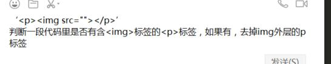

# 1.去除p标签

[code](./code/1.html)

    function clearPTag(html) {
        const spaceReg = />(\s+)</g
        const htmlReg = /<p[^>]*>(.*?)<\/p>/gi
        const imgReg = /]*>/i

        return html
            .replace(spaceReg, (str, capture) => str.replace(capture, ''))
            .replace(htmlReg, (str, capture) => imgReg.test(capture) ? capture : str)
    }